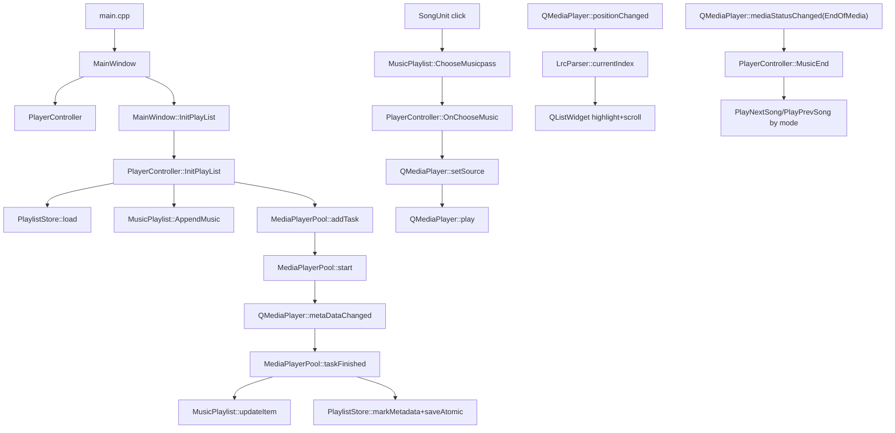

# MusicPlayer

一个基于 **Qt 6.8.3** 的本地音乐播放器，支持播放本地音频文件、展示封面和歌曲信息、歌词滚动显示、列表循环 / 随机播放 / 单曲循环等功能。UI 使用 Qt Widgets 实现，整体风格简单清爽。

> 作者：**misaka**  
> 项目类型：个人学习 / 练手项目

---

## 功能介绍

- **本地音乐扫描**
  - 启动后自动扫描可执行文件同目录下的 `MusicList` 文件夹。
  - 支持的音频格式：`mp3 / wav / flac / aac / ogg / m4a / wma`。

- **播放控制**
  - 播放 / 暂停、上一首、下一首。
  - 三种播放模式：
    - **列表循环**（List_Play）
    - **随机播放**（Loop_Play，内部使用洗牌算法生成播放顺序）
    - **单曲循环**（Repeat_Play）

- **播放列表**
  - 使用自定义 `MusicPlaylist` 窗口显示所有歌曲。
  - 每一行是一个 `SongUnit`，包含封面、歌曲名、艺术家。
  - 鼠标悬停高亮、点击即可切换播放。

- **封面与元数据**
  - 利用 `MediaPlayerPool` 对象池异步解析音频元数据。
  - 从音频文件中读取封面、标题、艺术家等信息，更新到播放列表和主界面。

- **歌词显示**
  - 支持 `.lrc` 歌词文件（与音频文件同名、同目录）。
  - 支持多种编码自动识别（UTF‑8、GBK、GB2312、GB18030、UTF‑16 等）。
  - 通过 `LrcParser` 解析时间戳，`QListWidget` 同步高亮当前行并居中滚动显示。

- **UI 与交互**
  - 控制面板采用圆角白色卡片风格。
  - 中间显示专辑封面和歌曲名（加粗、大号字体）。
  - 歌曲名、艺术家名支持“跑马灯”滚动效果（`MarqueeLabel`），适合长文本显示。
  - 播放进度条支持拖动，并在播放结束时自动切换到下一首。

---

## 代码框架与数据流

本项目是一个典型的 **Qt Widgets 单窗口应用**：`MainWindow` 负责 UI 呈现与交互协调；`PlayerController` 负责播放控制与业务逻辑；播放列表、歌词、元数据解析与本地持久化各自拆分成独立组件。

- **入口层**
  - `main.cpp`：创建 `QApplication`，设置窗口图标，显示 `MainWindow`，进入事件循环。
- **展示层（UI）**
  - `MainWindow`：主界面与事件过滤（进度条拖动 seek、歌词滚轮/点击、窗口拖拽与边缘缩放等）。
  - `MusicPlaylist`：右侧播放列表面板（滑入/滑出动画），内部由多个 `SongUnit` 组成。
  - `SongUnit`：列表单行（封面、标题、艺术家；点击发出选曲信号）。
  - `MarqueeLabel`：用于长文本的跑马灯滚动显示（歌名/艺术家）。
  - `MoreMenu`：更多菜单（运行期添加本地音乐）。
- **控制层（业务）**
  - `PlayerController`：持有主 `QMediaPlayer`/`QAudioOutput`，管理播放模式（`List_Play`/`Loop_Play`/`Repeat_Play`）、上一首/下一首、自动下一首、与列表/元数据/持久化的交互。
- **服务层（工具/数据）**
  - `MediaPlayerPool`：对象池 + 多 `QMediaPlayer` worker 并发读取 `QMediaMetaData`（标题/艺术家/封面）。
  - `LrcParser`：多编码读取 `.lrc` 并解析时间戳，提供按播放进度定位当前行。
  - `PlaylistStore`：加载/保存 `playlist.json`，缓存封面到 `Metadata/`，实现“重启后恢复列表与元数据”。

### 主流程（启动 → 列表 → 元数据 → 播放/歌词）



---

## 对象树（Qt 父子与所有权）

以下是关键对象的父子关系（简化版，用于理解生命周期与释放时机）。大多数对象以 `MainWindow` 或 `PlayerController` 为 parent，随其析构自动释放。

- **QApplication**
  - **MainWindow**
    - `Ui::MainWindow` 创建的控件树（来自 `mainwindow.ui`）
      - `imagelabel`、`lyricsListWidget`、`Slider`、控制区按钮（播放/上一首/下一首/模式/列表）、`MarqueeLabel`（`namelabel`/`artistlabel`）等
    - **m_emptyOverlayLabel**：空列表提示 overlay（QLabel）
    - **m_moremenuwindow**：更多菜单（MoreMenu）
    - **m_musicplaylist**：播放列表面板（MusicPlaylist）
      - `QScrollArea` + `QVBoxLayout`
      - 多个 **SongUnit**
    - **m_playerController**：播放控制器（PlayerController）
      - **m_player**：主播放 `QMediaPlayer`
      - **m_audioOutput**：`QAudioOutput`
      - **m_pool**：元数据解析池（MediaPlayerPool）
        - 多个 Worker（每个 Worker 内一个 `QMediaPlayer`，仅用于读元数据）
    - **m_lrcParser**：歌词解析器（LrcParser）
    - **m_wheelTimer**：歌词手动滚动恢复计时（QTimer）

---

## 技术栈

- **语言与标准**：C++17
- **Qt 版本**：Qt 6.8.3
  - **Qt Widgets**：界面与交互
  - **Qt Multimedia**：`QMediaPlayer` / `QAudioOutput` 音频播放与元数据读取（`QMediaMetaData`）
- **构建系统**：CMake（最低 3.16），启用 `AUTOUIC/AUTOMOC/AUTORCC`
- **UI**：Qt Designer（`.ui`），QSS（`style.qss`），Qt 资源系统（`res.qrc`）
- **持久化**：可执行文件目录下 `playlist.json`；封面缓存 `Metadata/<key>.png`（由 `PlaylistStore` 管理）
- **解析**：`.lrc` 多编码解码（UTF‑8/GBK/GB2312/GB18030/UTF‑16），正则解析时间戳；歌词按时间排序并二分定位

---

## 项目结构与关键代码

核心文件简要说明：

- `main.cpp`  
  应用入口，创建 `QApplication` 并显示 `MainWindow`。
  - **关键点**：设置窗口图标（资源 `:/res/misaka.png`），进入 Qt 事件循环 `a.exec()`。

- `mainwindow.h / mainwindow.cpp`  
  主窗口类，负责：
  - 初始化窗口、按钮、UI 样式。
  - 创建并摆放 `MusicPlaylist`。
  - 连接 UI 与 `PlayerController` 的信号槽（按钮、进度条、歌词等）。
  - 处理元数据更新、歌词显示、窗口大小变化等。
  - **关键点**：
    - 根据 `playlistAvailabilityChanged` 统一控制“空列表占位”和播放控件可用性。
    - `eventFilter` 内集中处理：进度条拖动 seek、歌词滚轮暂停自动跟随、窗口拖拽与边缘缩放。

- `playercontroller.h / playercontroller.cpp`  
  **播放控制器（PlayerController）**：
  - 持有 `QMediaPlayer` 和 `QAudioOutput`。
  - 初始化播放列表（优先从 `playlist.json` 恢复；无则扫描 `MusicList` 并写入）。
  - 通过 `MediaPlayerPool` 异步解析封面和标签，并写回 `PlaylistStore`（用于下次启动恢复与加速）。
  - 统一管理播放模式（列表循环 / 随机 / 单曲）、上一首 / 下一首 / 单曲循环、“自动下一首”等逻辑。
  - 对外暴露简单接口（`PlayPrevSong / PlayNextSong / PlaySong / MusicEnd / SetPlayMode / GetPlayMode` 等），减轻 `MainWindow` 负担。
  - **关键点**：
    - `InitPlayList()`：从 `PlaylistStore` 读取 tracks，或扫描 `MusicList/` 并生成 `playlist.json`；对未解析元数据的项提交 `m_pool->addTask(url, index)`。
    - `Loop_Play` 下使用 Fisher–Yates 洗牌生成随机播放顺序（`UpdateRandomArray()`）。
    - 为避免个别音频 “play 后卡 0ms”，在 `playbackStateChanged` 后做一次 200ms 的 position 检测并轻微 `setPosition(1)` 触发时钟启动。

- `musicplaylist.h / musicplaylist.cpp / musicplaylist.ui`  
  播放列表窗口：
  - 内部使用 `QScrollArea + QVBoxLayout` 管理多个 `SongUnit`。
  - 提供追加歌曲、更新某一项封面/标题/艺术家等接口。
  - 通过信号 `ChooseMusicpass(int id)` 告诉 `PlayerController` 用户选择了哪一首。
  - **关键点**：`showAnimated()/hideAnimated()` 用 opacity + pos 动画实现滑入/滑出；空列表显示占位文案。

- `songunit.h / songunit.cpp / songunit.ui`  
  播放列表中的一行（单曲项）：
  - 显示歌曲封面、名称、艺术家。
  - 鼠标悬停高亮，点击时发出 `ChooseMusic(int id)` 信号。
  - **关键点**：`id` 由 `MusicPlaylist` 维护并在删除时重排，保证点击回传索引与当前列表一致。

- `MediaPlayerPool.h / mediaplayerpool.cpp`  
  使用小型对象池模式管理多个 `QMediaPlayer`，异步读取音频文件的元数据：
  - 解析标题、艺术家、封面图等。
  - 解析完成后通过 `taskFinished` 信号返回结果，更新对应 `SongUnit`。
  - **关键点**：`start()` 内用 `while` 将“空闲 worker”与“待处理任务”批量配对；完成/失败后 `QTimer::singleShot(0, start)` 继续调度，避免重入。

- `lrcparser.h / lrcparser.cpp`  
  歌词解析器：
  - 支持多编码自动尝试。
  - 使用正则表达式解析 `[mm:ss.xx]` 或 `[mm:ss.xxx]` 格式的时间戳。
  - 提供按时间查找当前歌词行的接口。
  - **关键点**：按毫秒时间排序；`currentIndex(position)` 用二分查找定位当前高亮行。

- `marqueelabel.h / marqueelabel.cpp`  
  跑马灯标签：
  - 当文本宽度超过标签宽度时，自动横向循环滚动。
  - 用于主界面的歌名、艺术家名显示。
  - **关键点**：在 `paintEvent` 中按偏移绘制两段文本实现无缝循环，`timerEvent` 更新偏移。

- `playliststore.h / playliststore.cpp`  
  播放列表与元数据持久化：
  - `playlist.json`：记录曲目 URL 与元数据是否已缓存。
  - `Metadata/`：缓存封面 PNG（文件名为对 URL 做 percent-encoding 的 key）。
  - **关键点**：`saveAtomic()` 使用安全写入（避免中途崩溃导致 JSON 损坏）；`markMetadata()` 在解析完成后写入封面并更新 title/artist。

- `moremenu.h / moremenu.cpp / moremenu.ui`  
  更多菜单：
  - 运行期通过文件选择框追加本地音乐（主窗口接收 `addMusicClicked` 后调用 `PlayerController::AddLocalFiles()`）。

- `res.qrc`  
  Qt 资源文件，包含图标、背景图片等（如播放按钮图标、默认封面图片等）。

- `CMakeLists.txt`  
  CMake 构建配置，启用了 `AUTOUIC/AUTOMOC/AUTORCC`，并链接 `Qt6::Widgets` 和 `Qt6::Multimedia`。

---

## 环境与依赖

- **Qt 版本**：Qt 6.8.3（Qt Widgets / Qt Multimedia）
- **构建系统**：CMake（最低 3.16；可搭配 Ninja 或 Visual Studio 生成器）
- **编译器**：任意支持 C++17 的编译器（例如 MSVC / Clang / GCC / MinGW）

> 上述更完整的模块与持久化说明见上方「技术栈」小节。

---

## 编译与运行

1. **准备音乐文件**

   - 在构建生成的可执行文件同级目录下创建 `MusicList` 文件夹，例如：
     - Windows：`<build-dir>\MusicPlayer.exe` 旁边创建 `MusicList\`
   - 将你的音频文件放到 `MusicList` 中（支持的格式见上）。
   - 如需歌词，在同一目录下放置同名 `.lrc` 文件，例如：
     - `song.mp3` 对应 `song.lrc`

2. **使用 CMake 构建**

   ```bash
   # 在项目根目录（包含 CMakeLists.txt）下
   mkdir build
   cd build

   cmake -G "Ninja" ..
   cmake --build .
   ```

> 说明：运行时会以 **可执行文件所在目录** 作为数据目录（`MusicList/`、`playlist.json`、`Metadata/` 均在该目录下创建/读取）。在 Windows 下，通常是 `build/<config>/` 目录中的 `MusicPlayer.exe` 所在位置。
