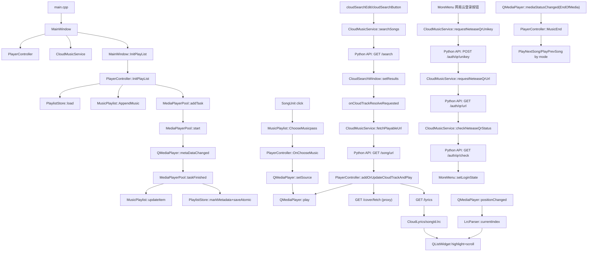
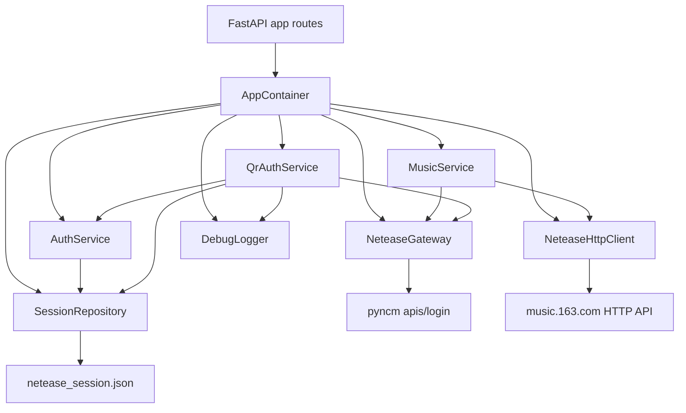

# MusicPlayer

一个基于 **Qt 6.8.3** 的桌面音乐播放器，采用 **Qt 客户端 + Python FastAPI 本地后端** 双端架构。客户端负责播放控制、歌词渲染与交互体验，Python 后端负责对接网易云接口、会话管理、云歌曲链接解析与音频/封面代理，避免把第三方协议细节直接耦合到 C++ 侧。项目支持本地音乐播放与云端搜索播放，包含封面展示、歌词滚动显示、列表循环 / 随机播放 / 单曲循环，以及网易云账号登录（含二维码登录）等功能。

> 作者：**misaka**  
> 项目类型：个人学习 / 练手项目
> B站介绍视频：https://www.bilibili.com/video/BV1tMwCz9ELE?vd_source=5c1b12b66171a9862c79dcafb489f9b8

---

## 功能介绍

- **本地音乐扫描**
  - 启动后自动扫描可执行文件同目录下的 `MusicList` 文件夹。
  - 支持的音频格式：`mp3 / wav / flac / aac / ogg / m4a / wma`。

- **云音乐搜索与播放**
  - 支持在主界面搜索框搜索云端歌曲（回车或点击搜索）。
  - 选中搜索结果后自动解析可播放链接并加入列表播放。
  - 自动拉取云端封面与歌词，并在本地缓存歌词到 `CloudLyrics/`。

- **播放控制**
  - 播放 / 暂停、上一首、下一首。
  - 三种播放模式：
    - **列表循环**（List_Play）
    - **随机播放**（Loop_Play，内部使用洗牌算法生成播放顺序）
    - **单曲循环**（Repeat_Play）

- **播放列表**
  - 使用自定义 `MusicPlaylist` 窗口显示所有歌曲。
  - 每一行是一个 `SongUnit`，包含封面、歌曲名、艺术家。
  - 鼠标悬停高亮、点击即可切换播放。

- **封面与元数据**
  - 利用 `MediaPlayerPool` 对象池异步解析音频元数据。
  - 从音频文件中读取封面、标题、艺术家等信息，更新到播放列表和主界面。

- **歌词显示**
  - 支持 `.lrc` 歌词文件（与音频文件同名、同目录）。
  - 支持多种编码自动识别（UTF‑8、GBK、GB2312、GB18030、UTF‑16 等）。
  - 通过 `LrcParser` 解析时间戳，`QListWidget` 同步高亮当前行并居中滚动显示。
  - 云端歌曲歌词由本地 Python 服务拉取后按 `songId.lrc` 缓存。

- **网易云账号登录**
  - 支持菜单中触发网易云登录/退出。
  - 支持二维码登录流程：请求 unikey -> 获取二维码 URL -> 轮询登录状态。
  - 启动时自动尝试恢复上次登录会话状态。

- **UI 与交互**
  - 控制面板采用圆角白色卡片风格。
  - 中间显示专辑封面和歌曲名（加粗、大号字体）。
  - 歌曲名、艺术家名支持“跑马灯”滚动效果（`MarqueeLabel`），适合长文本显示。
  - 播放进度条支持拖动，并在播放结束时自动切换到下一首。

---

## 代码框架与数据流

本项目由 **Qt 客户端 + Python 本地服务** 组成：`MainWindow` 负责 UI 呈现与交互协调；`PlayerController` 负责播放控制与业务逻辑；`CloudMusicService` 负责与本地 API 交互；播放列表、歌词、元数据解析与持久化各自拆分成独立组件。

- **入口层**
  - `main.cpp`：创建 `QApplication`，设置窗口图标，显示 `MainWindow`，进入事件循环。
- **展示层（UI）**
  - `MainWindow`：主界面与事件过滤（进度条拖动 seek、歌词滚轮/点击、窗口拖拽与边缘缩放等）。
  - `MusicPlaylist`：右侧播放列表面板（滑入/滑出动画），内部由多个 `SongUnit` 组成。
  - `SongUnit`：列表单行（封面、标题、艺术家；点击发出选曲信号）。
  - `MarqueeLabel`：用于长文本的跑马灯滚动显示（歌名/艺术家）。
  - `MoreMenu`：更多菜单（运行期添加本地音乐）。
- **控制层（业务）**
  - `PlayerController`：持有主 `QMediaPlayer`/`QAudioOutput`，管理播放模式（`List_Play`/`Loop_Play`/`Repeat_Play`）、上一首/下一首、自动下一首、与列表/元数据/持久化的交互。
  - `CloudMusicService`：封装云搜索、歌曲 URL 解析、歌词获取、网易云登录状态查询与二维码登录流程。
- **服务层（工具/数据）**
  - `MediaPlayerPool`：对象池 + 多 `QMediaPlayer` worker 并发读取 `QMediaMetaData`（标题/艺术家/封面）。
  - `LrcParser`：多编码读取 `.lrc` 并解析时间戳，提供按播放进度定位当前行。
  - `PlaylistStore`：加载/保存 `playlist.json`，缓存封面到 `Metadata/`，并持久化云歌曲记录（`cloudSongId`）。
  - `python/server/main.py`（FastAPI）：对接 pyncm，提供 `/search`、`/song/url`、`/lyrics`、`/auth/*` 等本地接口。

### 主流程（启动 → 本地播放 / 云播放）


```mermaid
flowchart TD
  AppStart[main.cpp] --> MainWindowCtor[MainWindow]
  MainWindowCtor --> PlayerControllerCtor[PlayerController]
  MainWindowCtor --> CloudServiceCtor[CloudMusicService]
  MainWindowCtor --> InitPlayList[MainWindow::InitPlayList]
  InitPlayList --> ControllerInit[PlayerController::InitPlayList]
  ControllerInit --> PlaylistStoreLoad[PlaylistStore::load]
  ControllerInit --> MusicPlaylistAdd[MusicPlaylist::AppendMusic]
  ControllerInit --> MediaPoolAdd[MediaPlayerPool::addTask]
  MediaPoolAdd --> MediaPoolStart[MediaPlayerPool::start]
  MediaPoolStart --> MetaDataReady["QMediaPlayer::metaDataChanged"]
  MetaDataReady --> TaskFinished[MediaPlayerPool::taskFinished]
  TaskFinished --> UpdateItem[MusicPlaylist::updateItem]
  TaskFinished --> StoreMeta[PlaylistStore::markMetadata+saveAtomic]

  SongClick[SongUnit click] --> ChooseMusicpass[MusicPlaylist::ChooseMusicpass]
  ChooseMusicpass --> OnChooseMusic[PlayerController::OnChooseMusic]
  OnChooseMusic --> SetSource[QMediaPlayer::setSource]
  SetSource --> Play[QMediaPlayer::play]

  CloudSearchUI[cloudSearchEdit/cloudSearchButton] --> CloudSearchReq[CloudMusicService::searchSongs]
  CloudSearchReq --> PySearch["Python API: GET /search"]
  PySearch --> CloudResultWin[CloudSearchWindow::setResults]
  CloudResultWin --> ResolveTrack[onCloudTrackResolveRequested]
  ResolveTrack --> CloudPlayReq[CloudMusicService::fetchPlayableUrl]
  CloudPlayReq --> PySongUrl["Python API: GET /song/url"]
  PySongUrl --> AddCloudTrack[PlayerController::addOrUpdateCloudTrackAndPlay]
  AddCloudTrack --> Play
  AddCloudTrack --> FetchCloudCover["GET /cover/fetch (proxy)"]
  AddCloudTrack --> FetchCloudLyrics["GET /lyrics"]
  FetchCloudLyrics --> SaveCloudLrc[CloudLyrics/songId.lrc]
  SaveCloudLrc --> LyricsUI

  MoreMenuAuth[MoreMenu 网易云登录按钮] --> QrUnikey[CloudMusicService::requestNeteaseQrUnikey]
  QrUnikey --> PyAuthUnikey["Python API: POST /auth/qr/unikey"]
  PyAuthUnikey --> QrUrlReq[CloudMusicService::requestNeteaseQrUrl]
  QrUrlReq --> PyAuthQrUrl["Python API: GET /auth/qr/url"]
  PyAuthQrUrl --> QrStatusPoll[CloudMusicService::checkNeteaseQrStatus]
  QrStatusPoll --> PyAuthQrCheck["Python API: GET /auth/qr/check"]
  PyAuthQrCheck --> LoginStateUpdate[MoreMenu::setLoginState]

  PositionChanged["QMediaPlayer::positionChanged"] --> LrcIndex[LrcParser::currentIndex]
  LrcIndex --> LyricsUI[QListWidget highlight+scroll]
  EndOfMedia["QMediaPlayer::mediaStatusChanged(EndOfMedia)"] --> MusicEnd[PlayerController::MusicEnd]
  MusicEnd --> NextSong[PlayNextSong/PlayPrevSong by mode]
```

---

## 对象与组件结构

### Qt 客户端对象树（Qt 父子与所有权）

以下是 Qt 客户端关键对象的父子关系（简化版，用于理解生命周期与释放时机）。大多数对象以 `MainWindow` 或 `PlayerController` 为 parent，随其析构自动释放。

- **QApplication**
  - **MainWindow**
    - `Ui::MainWindow` 创建的控件树（来自 `mainwindow.ui`）
      - `imagelabel`、`lyricsListWidget`、`Slider`、控制区按钮（播放/上一首/下一首/模式/列表/更多）、云搜索输入框与搜索按钮、`MarqueeLabel`（`namelabel`/`artistlabel`）等
    - **m_emptyOverlayLabel**：空列表提示 overlay（QLabel）
    - **m_moremenuwindow**：更多菜单（MoreMenu）
    - **m_cloudSearchWindow**：云搜索结果窗口（CloudSearchWindow）
    - **m_cloudService**：云接口客户端（CloudMusicService）
    - **m_coverNam**：封面/二维码图片网络请求管理器（QNetworkAccessManager）
    - **m_neteaseQrDialog**：网易云扫码登录弹窗（QDialog）
      - **m_neteaseQrImageLabel**：二维码图片展示（QLabel）
    - **m_musicplaylist**：播放列表面板（MusicPlaylist）
      - `QScrollArea` + `QVBoxLayout`
      - 多个 **SongUnit**
    - **m_playerController**：播放控制器（PlayerController）
      - **m_player**：主播放 `QMediaPlayer`
      - **m_audioOutput**：`QAudioOutput`
      - **m_pool**：元数据解析池（MediaPlayerPool）
        - 多个 Worker（每个 Worker 内一个 `QMediaPlayer`，仅用于读元数据）
    - **m_lrcParser**：歌词解析器（LrcParser）
    - **m_wheelTimer**：歌词手动滚动恢复计时（QTimer）

### Python 后端组件图（职责与依赖）


```mermaid
flowchart TD
  FastAPI[FastAPI app routes] --> Container[AppContainer]
  Container --> MusicService[MusicService]
  Container --> AuthService[AuthService]
  Container --> QrAuthService[QrAuthService]
  Container --> SessionRepo[SessionRepository]
  Container --> Gateway[NeteaseGateway]
  Container --> HttpClient[NeteaseHttpClient]
  Container --> Logger[DebugLogger]

  MusicService --> Gateway
  MusicService --> HttpClient
  AuthService --> SessionRepo
  QrAuthService --> Gateway
  QrAuthService --> AuthService
  QrAuthService --> SessionRepo
  QrAuthService --> Logger
  Gateway --> PyNCM[pyncm apis/login]
  HttpClient --> NeteaseAPI[music.163.com HTTP API]
  SessionRepo --> SessionFile[netease_session.json]
```

---

## 技术栈

- **客户端（Desktop App）**
  - **语言/标准**：`C++17`
  - **框架**：`Qt 6.8.3`
    - `Qt Widgets`：窗口、控件、事件过滤、动画交互（播放列表滑入滑出、无边框拖拽缩放）
    - `Qt Multimedia`：`QMediaPlayer` + `QAudioOutput` 音频播放、媒体状态管理、元数据读取
    - `Qt Network`：云搜索、播放地址解析、歌词拉取、登录态请求、封面下载
  - **UI 工程化**：`Qt Designer (.ui)` + `QSS(style.qss)` + `Qt Resource System(res.qrc)`
  - **并发与异步模型**：基于 Qt 事件循环 + Signal/Slot，网络请求与元数据任务异步回调驱动

- **后端（Local Cloud Gateway）**
  - **语言**：`Python 3.9+`
  - **Web 框架**：`FastAPI`（本地 API 编排与契约输出）
  - **ASGI 服务器**：`uvicorn`
  - **第三方能力接入**：`pyncm`（网易云搜索、歌曲详情、播放地址、歌词、登录相关能力）
  - **后端职责**：上游 API 适配、会话持久化、二维码登录兼容、流媒体/封面代理、统一错误模型

- **接口与协议**
  - **客户端与本地后端**：HTTP/JSON（默认 `http://127.0.0.1:8000`）
  - **核心接口**：`/search`、`/song/url`、`/song/stream`、`/cover/fetch`、`/lyrics`、`/auth/*`
  - **流媒体能力**：`Range` 透传 + `206 Partial Content` 兼容，支持播放器 seek 分段拉流
  - **响应约定**：统一 `code/message/data` 结构，降低 C++ 端解析分支复杂度

- **数据与持久化**
  - **本地播放数据**：`playlist.json`（播放列表、元数据状态、云歌曲标识）
  - **封面缓存**：`Metadata/<key>.png`（URL key 化存储，减少重复拉取）
  - **云歌词缓存**：`CloudLyrics/<songId>.lrc`
  - **后端会话**：`python/server/netease_session.json`（网易云登录态恢复）
  - **原子写入策略**：关键清单文件采用安全写入，降低异常退出导致的数据损坏风险

- **构建与运行**
  - **构建系统**：`CMake >= 3.16`（启用 `AUTOUIC` / `AUTOMOC` / `AUTORCC`）
  - **Qt 链接模块**：`Qt6::Widgets`、`Qt6::Multimedia`、`Qt6::Network`
  - **编译器要求**：任意支持 C++17 的工具链（MSVC / Clang / GCC / MinGW）
  - **部署形态**：本地双进程（Qt GUI 进程 + Python API 进程）

---

## Python 后端实现（V2.0版本主要新增内容）

`python/server/main.py` 是 Qt 客户端的本地云能力中枢，定位是“**网易云能力适配层 + 本地会话与代理层**”。

- **接口契约层（对 Qt 暴露）**
  - 搜索：`GET /search`
  - 播放地址：`GET /song/url`
  - 音频代理流：`GET /song/stream`
  - 封面代理：`GET /cover/fetch`
  - 歌词：`GET /lyrics`
  - 登录与鉴权：`POST /auth/login`、`GET /auth/status`、`POST /auth/logout`
  - 二维码登录：`POST /auth/qr/unikey`、`GET /auth/qr/url`、`GET /auth/qr/check`

- **内部分层设计**
  - `AppContainer`：组合根/轻量依赖注入容器，统一组装服务对象。
  - `MusicService`：搜索、链接解析、歌词、流媒体代理等音乐业务逻辑。
  - `AuthService`：账号密码登录、登录状态与退出登录。
  - `QrAuthService`：二维码登录全流程、状态码翻译、登录后会话落盘。
  - `NeteaseGateway`：第三方调用门面，收敛 pyncm 与原始 HTTP 调用细节。
  - `NeteaseHttpClient`：统一请求头、超时与流读取策略。
  - `SessionRepository`：`netease_session.json` 的读写与会话恢复。

- **关键实现点**
  - **代理隔离**：调用 pyncm 前临时清空系统代理变量，规避本地代理异常导致的连接失败。
  - **版本兼容**：二维码登录相关 API 采用候选函数名逐一尝试，兼容不同 pyncm 版本命名差异。
  - **播放兜底**：`/song/url` 同时返回 `originUrl/proxyUrl`，Qt 可在部分环境 403 场景回退直连。
  - **Seek 友好流式传输**：`/song/stream` 透传 `Range`，支持播放器分片拉流与拖动进度。
  - **统一响应模型**：通过 `ResponseFactory` 保持 `code/message/data` 结构一致，降低 Qt 端解析复杂度。

- **本地持久化与运行约束**
  - 会话文件：`python/server/netease_session.json`
  - 默认监听：`127.0.0.1:8000`
  - 建议：固定工作目录启动后端，避免会话文件路径变化导致“已登录状态丢失”。

---

## 项目结构与关键代码

核心文件简要说明：

- `main.cpp`  
  应用入口，创建 `QApplication` 并显示 `MainWindow`。
  - **关键点**：设置窗口图标（资源 `:/res/misaka.png`），进入 Qt 事件循环 `a.exec()`。

- `mainwindow.h / mainwindow.cpp`  
  主窗口类，负责：
  - 初始化窗口、按钮、UI 样式。
  - 创建并摆放 `MusicPlaylist`。
  - 连接 UI 与 `PlayerController` 的信号槽（按钮、进度条、歌词等）。
  - 处理元数据更新、歌词显示、窗口大小变化等。
  - 处理云端搜索、云歌曲解析、封面拉取、云歌词缓存、网易云二维码登录流程。
  - **关键点**：
    - 根据 `playlistAvailabilityChanged` 统一控制“空列表占位”和播放控件可用性。
    - `eventFilter` 内集中处理：进度条拖动 seek、歌词滚轮暂停自动跟随、窗口拖拽与边缘缩放。

- `playercontroller.h / playercontroller.cpp`  
  **播放控制器（PlayerController）**：
  - 持有 `QMediaPlayer` 和 `QAudioOutput`。
  - 初始化播放列表（优先从 `playlist.json` 恢复；无则扫描 `MusicList` 并写入）。
  - 通过 `MediaPlayerPool` 异步解析封面和标签，并写回 `PlaylistStore`（用于下次启动恢复与加速）。
  - 统一管理播放模式（列表循环 / 随机 / 单曲）、上一首 / 下一首 / 单曲循环、“自动下一首”等逻辑。
  - 对外暴露简单接口（`PlayPrevSong / PlayNextSong / PlaySong / MusicEnd / SetPlayMode / GetPlayMode` 等），减轻 `MainWindow` 负担。
  - **关键点**：
    - `InitPlayList()`：从 `PlaylistStore` 读取 tracks，或扫描 `MusicList/` 并生成 `playlist.json`；对未解析元数据的项提交 `m_pool->addTask(url, index)`。
    - `Loop_Play` 下使用 Fisher–Yates 洗牌生成随机播放顺序（`UpdateRandomArray()`）。
    - 为避免个别音频 “play 后卡 0ms”，在 `playbackStateChanged` 后做一次 200ms 的 position 检测并轻微 `setPosition(1)` 触发时钟启动。

- `musicplaylist.h / musicplaylist.cpp / musicplaylist.ui`  
  播放列表窗口：
  - 内部使用 `QScrollArea + QVBoxLayout` 管理多个 `SongUnit`。
  - 提供追加歌曲、更新某一项封面/标题/艺术家等接口。
  - 通过信号 `ChooseMusicpass(int id)` 告诉 `PlayerController` 用户选择了哪一首。
  - **关键点**：`showAnimated()/hideAnimated()` 用 opacity + pos 动画实现滑入/滑出；空列表显示占位文案。

- `songunit.h / songunit.cpp / songunit.ui`  
  播放列表中的一行（单曲项）：
  - 显示歌曲封面、名称、艺术家。
  - 鼠标悬停高亮，点击时发出 `ChooseMusic(int id)` 信号。
  - **关键点**：`id` 由 `MusicPlaylist` 维护并在删除时重排，保证点击回传索引与当前列表一致。

- `MediaPlayerPool.h / mediaplayerpool.cpp`  
  使用小型对象池模式管理多个 `QMediaPlayer`，异步读取音频文件的元数据：
  - 解析标题、艺术家、封面图等。
  - 解析完成后通过 `taskFinished` 信号返回结果，更新对应 `SongUnit`。
  - **关键点**：`start()` 内用 `while` 将“空闲 worker”与“待处理任务”批量配对；完成/失败后 `QTimer::singleShot(0, start)` 继续调度，避免重入。

- `lrcparser.h / lrcparser.cpp`  
  歌词解析器：
  - 支持多编码自动尝试。
  - 使用正则表达式解析 `[mm:ss.xx]` 或 `[mm:ss.xxx]` 格式的时间戳。
  - 提供按时间查找当前歌词行的接口。
  - **关键点**：按毫秒时间排序；`currentIndex(position)` 用二分查找定位当前高亮行。

- `marqueelabel.h / marqueelabel.cpp`  
  跑马灯标签：
  - 当文本宽度超过标签宽度时，自动横向循环滚动。
  - 用于主界面的歌名、艺术家名显示。
  - **关键点**：在 `paintEvent` 中按偏移绘制两段文本实现无缝循环，`timerEvent` 更新偏移。

- `playliststore.h / playliststore.cpp`  
  播放列表与元数据持久化：
  - `playlist.json`：记录曲目 URL 与元数据是否已缓存。
  - `Metadata/`：缓存封面 PNG（文件名为对 URL 做 percent-encoding 的 key）。
  - **关键点**：`saveAtomic()` 使用安全写入（避免中途崩溃导致 JSON 损坏）；`markMetadata()` 在解析完成后写入封面并更新 title/artist；支持云歌曲 `cloudSongId` 记录。

- `cloudmusicservice.h / cloudmusicservice.cpp`  
  云服务客户端（Qt 侧）：
  - 调用本地 Python API 完成搜索、播放链接解析、歌词获取。
  - 处理网易云登录、退出、二维码登录全流程接口。
  - **关键点**：统一网络/JSON 错误处理，播放链接请求失败时向 UI 发送结构化错误信号。

- `python/server/main.py`  
  本地云服务（FastAPI）：
  - 对接 pyncm 与网易云 API，提供 `/search`、`/song/url`、`/song/stream`、`/lyrics`、`/auth/login`、`/auth/qr/*` 等接口。
  - 维护本地会话 `netease_session.json`，支持重启后恢复登录态。
  - **关键点**：对代理环境做隔离处理，兼容不同 pyncm 版本的二维码登录 API 命名。

- `moremenu.h / moremenu.cpp / moremenu.ui`  
  更多菜单：
  - 运行期通过文件选择框追加本地音乐（主窗口接收 `addMusicClicked` 后调用 `PlayerController::AddLocalFiles()`）。

- `res.qrc`  
  Qt 资源文件，包含图标、背景图片等（如播放按钮图标、默认封面图片等）。

- `CMakeLists.txt`  
  CMake 构建配置，启用了 `AUTOUIC/AUTOMOC/AUTORCC`，并链接 `Qt6::Widgets`、`Qt6::Multimedia`、`Qt6::Network`。

---

## 环境与依赖

- **Qt 版本**：Qt 6.8.3（Qt Widgets / Qt Multimedia / Qt Network）
- **构建系统**：CMake（最低 3.16；可搭配 Ninja 或 Visual Studio 生成器）
- **编译器**：任意支持 C++17 的编译器（例如 MSVC / Clang / GCC / MinGW）
- **Python（云功能必需）**：Python 3.9+，建议虚拟环境
- **Python 依赖（云功能）**：`fastapi`、`uvicorn`、`pyncm`（见 `python/server/requirements.txt`）

> 上述更完整的模块与持久化说明见上方「技术栈」小节。

---

## 编译与运行

1. **（可选）启动本地云服务（用于云搜索/网易云登录）**

   ```bash
   cd python/server
   pip install -r requirements.txt
   python main.py
   # 或
   uvicorn main:app --host 127.0.0.1 --port 8000
   ```

   - 默认监听 `127.0.0.1:8000`，Qt 客户端通过该地址访问云接口。
   - 不启服务时，本地音乐播放仍可用，但云搜索/云播放/网易云登录不可用。

2. **准备音乐文件（本地播放）**

   - 在构建生成的可执行文件同级目录下创建 `MusicList` 文件夹，例如：
     - Windows：`<build-dir>\MusicPlayer.exe` 旁边创建 `MusicList\`
   - 将你的音频文件放到 `MusicList` 中（支持的格式见上）。
   - 如需歌词，在同一目录下放置同名 `.lrc` 文件，例如：
     - `song.mp3` 对应 `song.lrc`

3. **使用 CMake 构建 Qt 客户端**

   ```bash
   # 在项目根目录（包含 CMakeLists.txt）下
   mkdir build
   cd build

   cmake -G "Ninja" ..
   cmake --build .
   ```

> 说明：运行时会以 **可执行文件所在目录** 作为数据目录（`MusicList/`、`playlist.json`、`Metadata/` 均在该目录下创建/读取）。在 Windows 下，通常是 `build/<config>/` 目录中的 `MusicPlayer.exe` 所在位置。

